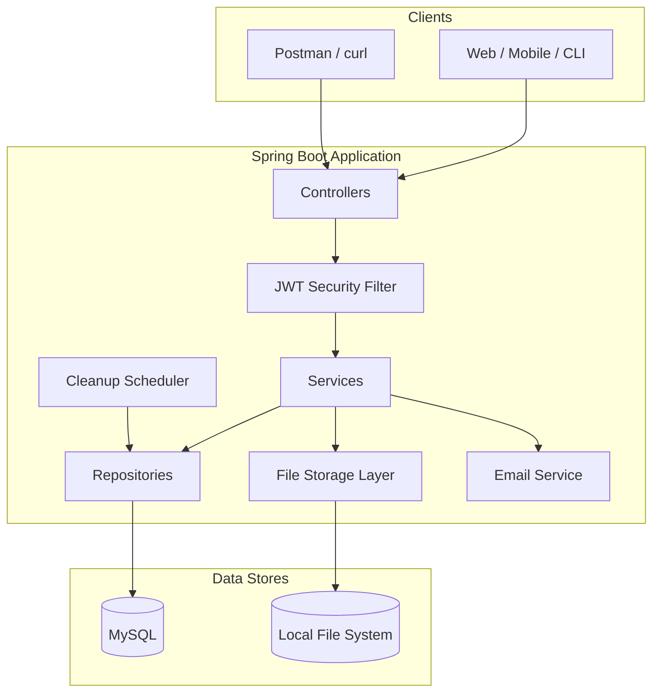
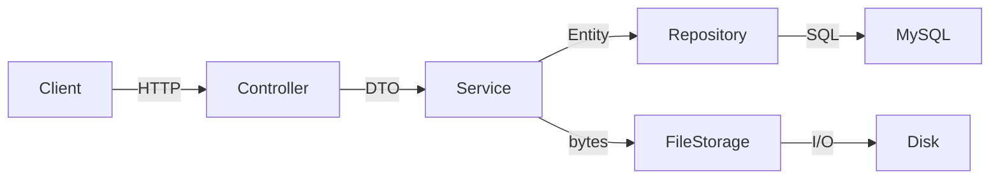
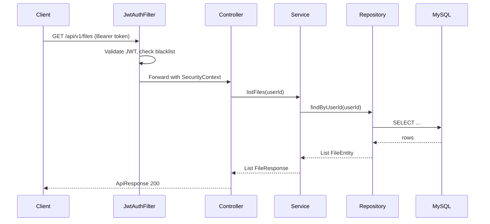
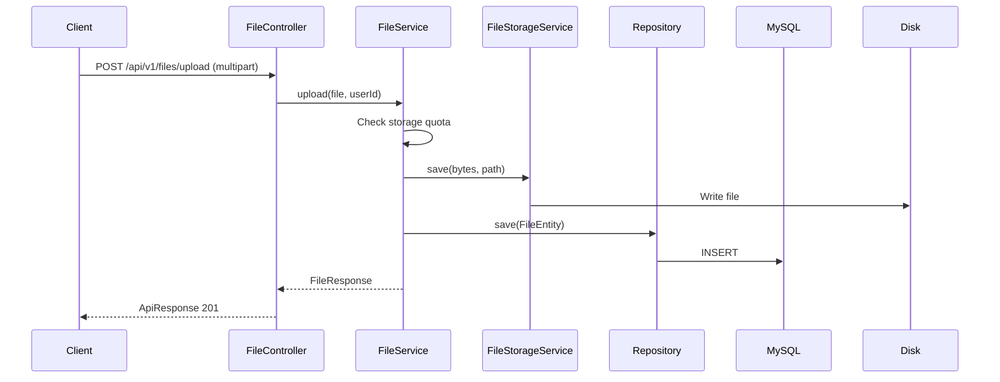
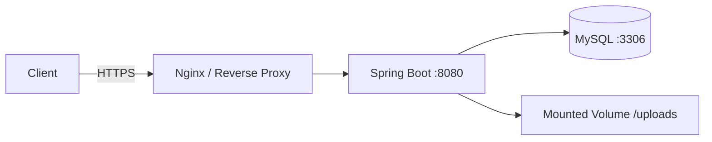

# System Architecture

High-level structure of clyDrive — how components connect and how a request flows through the system.

---

## Overview

clyDrive is a **stateless REST API** backed by MySQL (metadata) and local disk (file bytes). Clients authenticate with JWT and interact with resources through versioned HTTP endpoints.

---

## Layered Architecture

Each layer has a single responsibility. Dependencies flow **downward only**.

| Layer | Package | Responsibility |
|-------|---------|----------------|
| **Controller** | `controller` | HTTP mapping, request validation, response wrapping |
| **Service** | `service` / `service.impl` | Business logic, transactions, orchestration |
| **Repository** | `repository` | JPA data access — no business rules |
| **Entity** | `module` | JPA entities mapped to database tables |
| **DTO** | `dtos.request` / `dtos.response` | API contracts — separate from entities |
| **Security** | `security` | JWT filter, entry point, user details loader |
| **Config** | `config` | Security, async, password encoder, auditor |
| **Exception** | `exception` | Custom exceptions + global handler |
| **Util** | `util` | JWT helpers, shared utilities |
| **Scheduler** | `scheduler` | Cron jobs for token/OTP cleanup |
| **Initializer** | `initializer` | Seed default admin on startup |

---

## Component Map

| Component | Purpose |
|-----------|---------|
| `AuthController` | Login, logout, refresh, password flows |
| `UsersController` | Registration |
| `FileController` | Upload, download, list, delete files |
| `FolderController` | Folder CRUD and nesting |
| `ShareController` | Share link create/revoke/public download |
| `AdminController` | User management and system stats |
| `AuthService` | Authentication logic, token lifecycle |
| `UserService` | Registration and profile |
| `FileService` | File metadata + storage orchestration |
| `FolderService` | Folder tree operations |
| `ShareService` | Share token generation and validation |
| `AdminService` | Admin operations |
| `FileStorageService` | Abstract read/write/delete on disk |
| `EmailService` | Async SMTP for verification and OTP |
| `AuditService` | Write audit log entries |
| `TokenBlacklistService` | Invalidate JWTs on logout |
| `CleanupScheduler` | Purge expired tokens, OTPs, shares |
| `JwtAuthFilter` | Intercept requests, validate Bearer token |
| `GlobalExceptionHandler` | Map exceptions to `ApiResponse` errors |

---

## Request Lifecycle

### Authenticated request

### File upload

---

## Deployment Topology (v1)

| Environment | App | Database | File storage |
|-------------|-----|----------|--------------|
| Local dev | `localhost:8080` | MySQL Docker or local | `./uploads/` |
| Production | Container or VM | Managed MySQL | Persistent volume or future S3 |

---

## Design Principles

1. **Stateless** — no HTTP sessions; scale horizontally by adding app instances
2. **Metadata vs. bytes** — MySQL stores metadata; disk stores file content
3. **Storage abstraction** — `FileStorageService` interface hides local disk; swap to S3 later
4. **DTO boundary** — entities never exposed directly in API responses
5. **Fail secure** — unauthenticated or unauthorized requests rejected before reaching services
6. **Async side effects** — email sending does not block the HTTP response
