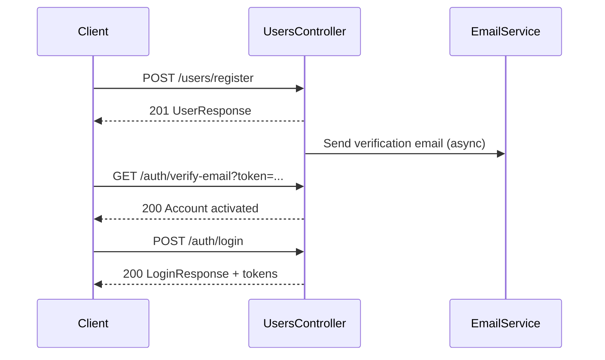
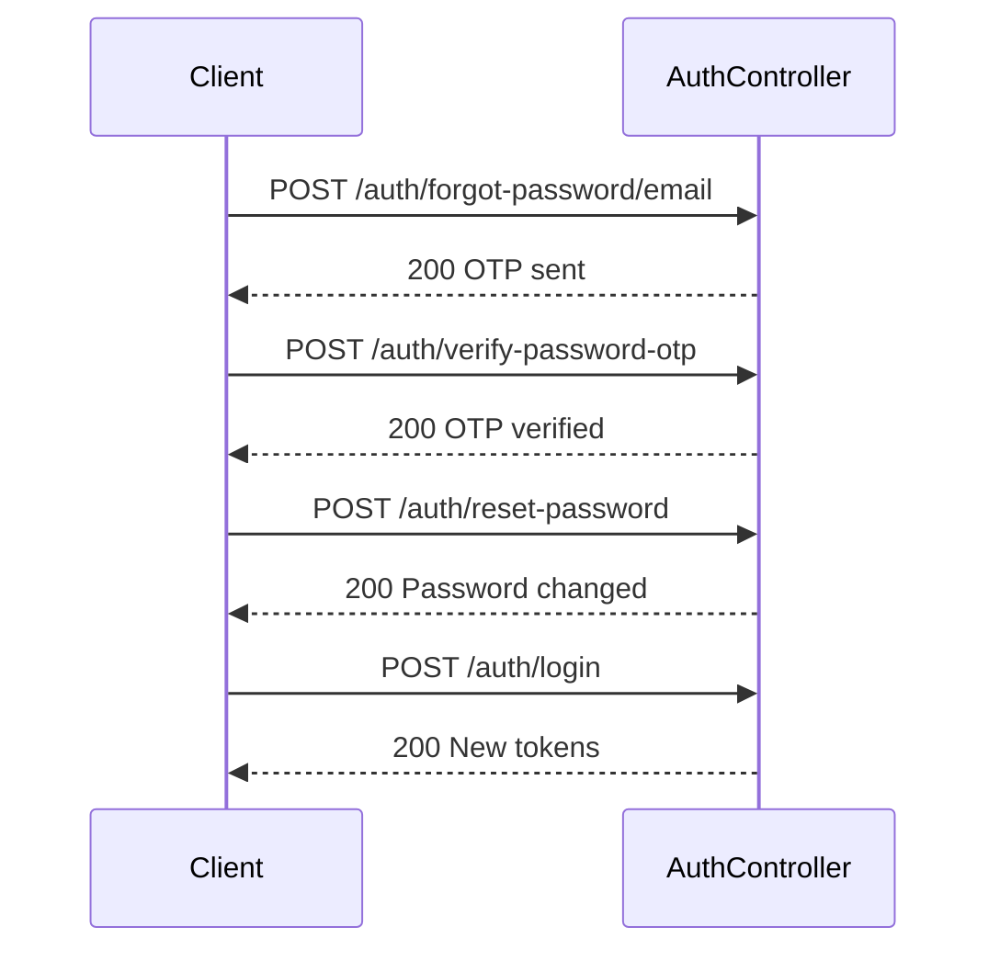

# API Design — Auth & Users

REST endpoints for registration, authentication, password management, and login history.

**Base URL:** `/api/v1`  
**Auth header:** `Authorization: Bearer <access_token>` (required on protected routes)

All responses use the standard `ApiResponse<T>` wrapper (detailed in a later doc).

---

## Users

### Register

Create a new account. Sends a verification email asynchronously.

```
POST /api/v1/users/register
```

**Auth:** Public

**Request body:**

```json
{
  "firstName": "John",
  "lastName": "Doe",
  "username": "johndoe",
  "email": "john@example.com",
  "password": "Secure@123",
  "phoneNumber": "9876543210"
}
```

| Field | Type | Rules |
|-------|------|-------|
| `firstName` | string | Required, 2–50 chars |
| `lastName` | string | Required, 2–50 chars |
| `username` | string | Required, 4–20 chars, unique |
| `email` | string | Required, valid email, unique |
| `password` | string | Required, 8–20 chars, must include upper, lower, digit, special char |
| `phoneNumber` | string | Required, 10-digit mobile number |

**Response `201 Created`:**

```json
{
  "status": 201,
  "message": "User registered successfully",
  "path": "/api/v1/users/register",
  "data": {
    "id": 1,
    "firstName": "John",
    "lastName": "Doe",
    "username": "johndoe",
    "email": "john@example.com",
    "role": "USER"
  }
}
```

**Errors:**

| Status | Condition |
|--------|-----------|
| `400` | Validation failure |
| `409` | Username or email already exists |

---

## Authentication

### Login

Authenticate with username **or** email.

```
POST /api/v1/auth/login
```

**Auth:** Public

**Request body:**

```json
{
  "identifier": "johndoe",
  "password": "Secure@123"
}
```

| Field | Type | Rules |
|-------|------|-------|
| `identifier` | string | Username or email |
| `password` | string | Required |

**Response `200 OK`:**

```json
{
  "status": 200,
  "message": "Login successful",
  "path": "/api/v1/auth/login",
  "data": {
    "username": "johndoe",
    "fullName": "John Doe",
    "email": "john@example.com",
    "phoneNumber": "9876543210",
    "tokens": {
      "accessToken": "eyJhbG...",
      "refreshToken": "eyJhbG..."
    }
  }
}
```

**Errors:**

| Status | Condition |
|--------|-----------|
| `401` | Invalid credentials |
| `401` | Email not verified |
| `403` | Account locked, disabled, or deleted |

---

### Logout

Invalidate the current access token and revoke the refresh token.

```
POST /api/v1/auth/logout
```

**Auth:** `USER` or `ADMIN`

**Headers:** `Authorization: Bearer <access_token>`

**Request body:**

```json
{
  "refreshToken": "eyJhbG..."
}
```

**Response `200 OK`:**

```json
{
  "status": 200,
  "message": "Logout successful",
  "path": "/api/v1/auth/logout",
  "data": {
    "message": "Logged out successfully"
  }
}
```

---

### Refresh Token

Obtain a new access token (and rotated refresh token) without re-login.

```
POST /api/v1/auth/refresh-token
```

**Auth:** Public (refresh token in body)

**Request body:**

```json
{
  "refreshToken": "eyJhbG..."
}
```

**Response `200 OK`:**

```json
{
  "status": 200,
  "message": "Token refreshed successfully",
  "path": "/api/v1/auth/refresh-token",
  "data": {
    "accessToken": "eyJhbG...",
    "refreshToken": "eyJhbG..."
  }
}
```

**Errors:**

| Status | Condition |
|--------|-----------|
| `401` | Invalid or expired refresh token |
| `401` | Refresh token revoked (logout / password change) |

---

## Email Verification

### Verify Email

Activate account via link sent to email.

```
GET /api/v1/auth/verify-email?token={token}
```

**Auth:** Public

**Response `200 OK`:**

```json
{
  "status": 200,
  "message": "Email verified successfully",
  "path": "/api/v1/auth/verify-email",
  "data": "Account activated"
}
```

**Errors:**

| Status | Condition |
|--------|-----------|
| `400` | Invalid or expired token |
| `404` | Token not found |

---

### Resend Verification Email

```
POST /api/v1/auth/resend-verification-email
```

**Auth:** Public

**Request body:**

```json
{
  "email": "john@example.com"
}
```

**Response `200 OK`:**

```json
{
  "status": 200,
  "message": "Verification email resent successfully",
  "path": "/api/v1/auth/resend-verification-email",
  "data": {
    "email": "john@example.com",
    "message": "Verification email sent"
  }
}
```

---

## Password Management

### Forgot Password (send OTP)

```
POST /api/v1/auth/forgot-password/email
```

**Auth:** Public

**Request body:**

```json
{
  "email": "john@example.com"
}
```

**Response `200 OK`:**

```json
{
  "status": 200,
  "message": "OTP sent successfully",
  "path": "/api/v1/auth/forgot-password/email",
  "data": {
    "email": "john@example.com",
    "expiresInMinutes": 10
  }
}
```

---

### Resend Password OTP

```
POST /api/v1/auth/resend-password-otp
```

**Auth:** Public

**Request body:** Same as forgot password (`email`)

**Response `200 OK`:** Same structure as forgot password

---

### Verify Password OTP

Confirm identity before allowing password reset.

```
POST /api/v1/auth/verify-password-otp
```

**Auth:** Public

**Request body:**

```json
{
  "email": "john@example.com",
  "otp": "123456"
}
```

**Response `200 OK`:**

```json
{
  "status": 200,
  "message": "OTP verified successfully",
  "path": "/api/v1/auth/verify-password-otp",
  "data": {
    "email": "john@example.com",
    "verified": true
  }
}
```

**Errors:**

| Status | Condition |
|--------|-----------|
| `400` | Invalid or expired OTP |

---

### Reset Password

Set a new password after OTP verification.

```
POST /api/v1/auth/reset-password
```

**Auth:** Public

**Request body:**

```json
{
  "email": "john@example.com",
  "newPassword": "NewSecure@456",
  "confirmPassword": "NewSecure@456"
}
```

**Response `200 OK`:**

```json
{
  "status": 200,
  "message": "Password changed successfully. Please login again.",
  "path": "/api/v1/auth/reset-password",
  "data": {
    "email": "john@example.com",
    "message": "Password reset successful"
  }
}
```

**Errors:**

| Status | Condition |
|--------|-----------|
| `400` | Passwords do not match |
| `400` | Password matches one of last 5 passwords |
| `400` | OTP not verified |

---

### Change Password

Authenticated user updates their password.

```
POST /api/v1/auth/change-password
```

**Auth:** `USER` or `ADMIN`

**Request body:**

```json
{
  "currentPassword": "Secure@123",
  "newPassword": "NewSecure@456"
}
```

**Response `200 OK`:**

```json
{
  "status": 200,
  "message": "Password changed successfully",
  "path": "/api/v1/auth/change-password",
  "data": {
    "message": "Password updated"
  }
}
```

**Side effects:** All existing tokens are invalidated; user must log in again.

---

## Login History

```
GET /api/v1/auth/login-history?userId={userId}
```

**Auth:** `USER` or `ADMIN`

**Response `200 OK`:**

```json
{
  "status": 200,
  "message": "Login history fetched successfully",
  "path": "/api/v1/auth/login-history",
  "data": [
    {
      "status": "SUCCESS",
      "ip": "192.168.1.1",
      "device": "Mozilla/5.0 ...",
      "time": "2026-06-28T10:30:00"
    },
    {
      "status": "FAILED",
      "ip": "192.168.1.1",
      "device": "Mozilla/5.0 ...",
      "time": "2026-06-28T10:29:00"
    }
  ]
}
```

---

## Endpoint Summary

| Method | Path | Auth | Description |
|--------|------|------|-------------|
| `POST` | `/api/v1/users/register` | Public | Register new user |
| `POST` | `/api/v1/auth/login` | Public | Login |
| `POST` | `/api/v1/auth/logout` | JWT | Logout |
| `POST` | `/api/v1/auth/refresh-token` | Public | Refresh access token |
| `GET` | `/api/v1/auth/verify-email` | Public | Verify email |
| `POST` | `/api/v1/auth/resend-verification-email` | Public | Resend verification |
| `POST` | `/api/v1/auth/forgot-password/email` | Public | Send reset OTP |
| `POST` | `/api/v1/auth/resend-password-otp` | Public | Resend reset OTP |
| `POST` | `/api/v1/auth/verify-password-otp` | Public | Verify reset OTP |
| `POST` | `/api/v1/auth/reset-password` | Public | Reset password |
| `POST` | `/api/v1/auth/change-password` | JWT | Change password |
| `GET` | `/api/v1/auth/login-history` | JWT | View login history |

---

## Flow Diagrams

### Registration & verification



### Password reset


