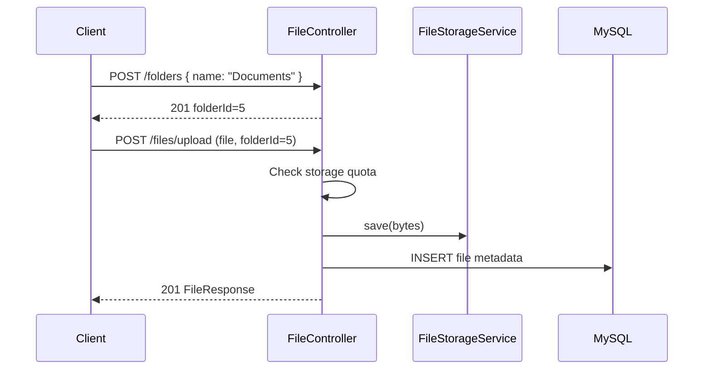
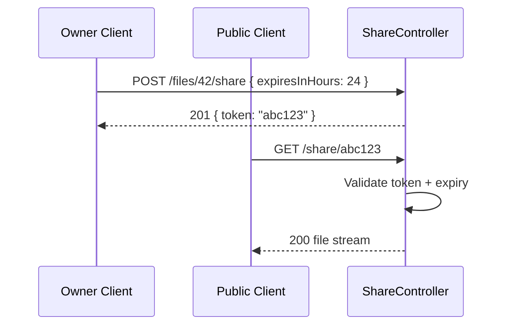
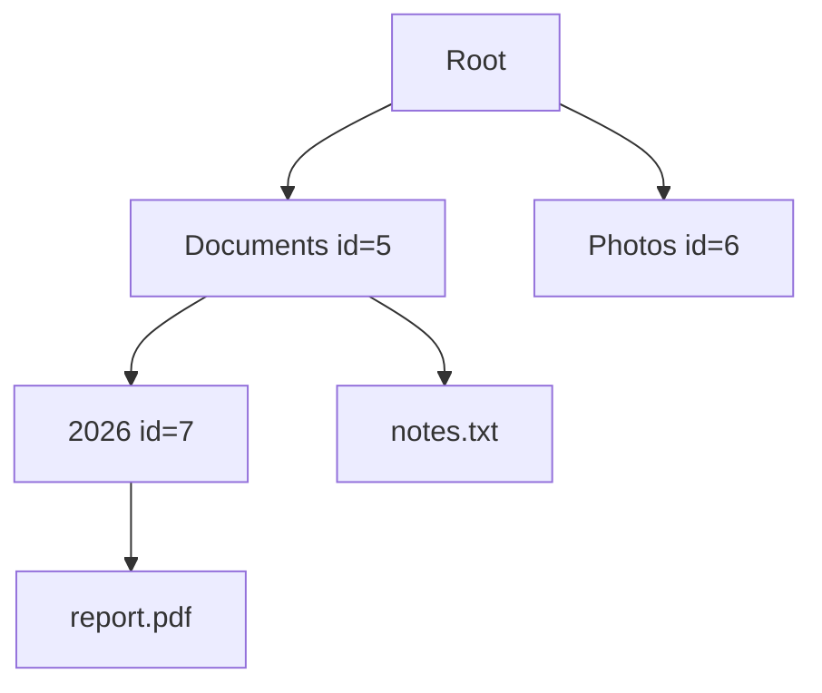

# API Design — Files, Folders & Sharing

REST endpoints for file storage, folder organization, share links, and storage usage.

**Base URL:** `/api/v1`  
**Auth header:** `Authorization: Bearer <access_token>` (except public share download)

---

## Files

### Upload

Upload a file. Optionally place it inside a folder.

```
POST /api/v1/files/upload
Content-Type: multipart/form-data
```

**Auth:** `USER` or `ADMIN`

**Form fields:**

| Field | Type | Required | Description |
|-------|------|----------|-------------|
| `file` | file | Yes | The file to upload |
| `folderId` | long | No | Target folder ID; omit for root |

**Response `201 Created`:**

```json
{
  "status": 201,
  "message": "File uploaded successfully",
  "path": "/api/v1/files/upload",
  "data": {
    "id": 42,
    "fileName": "a1b2c3-report.pdf",
    "originalName": "report.pdf",
    "fileType": "application/pdf",
    "size": 1048576,
    "folderId": 5,
    "uploadedAt": "2026-06-28T14:00:00"
  }
}
```

**Errors:**

| Status | Condition |
|--------|-----------|
| `400` | Empty file or unsupported type |
| `403` | Storage quota exceeded |
| `404` | `folderId` not found or not owned by user |

---

### List Files

Paginated list of the authenticated user's files.

```
GET /api/v1/files?page=0&size=20&folderId={folderId}&sort=uploadedAt,desc
```

**Auth:** `USER` or `ADMIN`

**Query parameters:**

| Param | Type | Default | Description |
|-------|------|---------|-------------|
| `page` | int | `0` | Page number (0-based) |
| `size` | int | `20` | Page size |
| `folderId` | long | — | Filter by folder; omit for root-level files |
| `sort` | string | `uploadedAt,desc` | Sort field and direction |

**Response `200 OK`:**

```json
{
  "status": 200,
  "message": "Files fetched successfully",
  "path": "/api/v1/files",
  "data": {
    "content": [
      {
        "id": 42,
        "fileName": "a1b2c3-report.pdf",
        "originalName": "report.pdf",
        "fileType": "application/pdf",
        "size": 1048576,
        "folderId": 5,
        "uploadedAt": "2026-06-28T14:00:00"
      }
    ],
    "page": 0,
    "size": 20,
    "totalElements": 1,
    "totalPages": 1
  }
}
```

---

### Get File Metadata

```
GET /api/v1/files/{id}
```

**Auth:** `USER` or `ADMIN` (owner only)

**Response `200 OK`:**

```json
{
  "status": 200,
  "message": "File fetched successfully",
  "path": "/api/v1/files/42",
  "data": {
    "id": 42,
    "fileName": "a1b2c3-report.pdf",
    "originalName": "report.pdf",
    "fileType": "application/pdf",
    "size": 1048576,
    "folderId": 5,
    "uploadedAt": "2026-06-28T14:00:00"
  }
}
```

**Errors:**

| Status | Condition |
|--------|-----------|
| `403` | File belongs to another user |
| `404` | File not found |

---

### Download File

Stream file bytes to the client.

```
GET /api/v1/files/{id}/download
```

**Auth:** `USER` or `ADMIN` (owner only)

**Response `200 OK`:**

```
Content-Type: application/pdf
Content-Disposition: attachment; filename="report.pdf"
Content-Length: 1048576

<binary stream>
```

**Errors:**

| Status | Condition |
|--------|-----------|
| `403` | File belongs to another user |
| `404` | File not found |

---

### Rename File

```
PUT /api/v1/files/{id}/rename
```

**Auth:** `USER` or `ADMIN` (owner only)

**Request body:**

```json
{
  "newName": "annual-report.pdf"
}
```

**Response `200 OK`:**

```json
{
  "status": 200,
  "message": "File renamed successfully",
  "path": "/api/v1/files/42/rename",
  "data": {
    "id": 42,
    "originalName": "annual-report.pdf",
    "fileName": "a1b2c3-report.pdf",
    "fileType": "application/pdf",
    "size": 1048576,
    "folderId": 5,
    "uploadedAt": "2026-06-28T14:00:00"
  }
}
```

---

### Move File

Move a file into a folder (or back to root).

```
PATCH /api/v1/files/{id}/move
```

**Auth:** `USER` or `ADMIN` (owner only)

**Request body:**

```json
{
  "folderId": 10
}
```

| Field | Type | Description |
|-------|------|-------------|
| `folderId` | long \| null | Target folder ID; `null` moves to root |

**Response `200 OK`:**

```json
{
  "status": 200,
  "message": "File moved successfully",
  "path": "/api/v1/files/42/move",
  "data": {
    "id": 42,
    "originalName": "report.pdf",
    "folderId": 10,
    "uploadedAt": "2026-06-28T14:00:00"
  }
}
```

---

### Delete File

Remove file from disk and database. Decrements storage usage.

```
DELETE /api/v1/files/{id}
```

**Auth:** `USER` or `ADMIN` (owner only)

**Response `200 OK`:**

```json
{
  "status": 200,
  "message": "File deleted successfully",
  "path": "/api/v1/files/42",
  "data": {
    "id": 42,
    "deleted": true
  }
}
```

---

## Folders

### Create Folder

```
POST /api/v1/folders
```

**Auth:** `USER` or `ADMIN`

**Request body:**

```json
{
  "name": "Documents",
  "parentId": null
}
```

| Field | Type | Rules |
|-------|------|-------|
| `name` | string | Required, 1–255 chars, no `/` or `\` |
| `parentId` | long \| null | Optional; `null` creates at root |

**Response `201 Created`:**

```json
{
  "status": 201,
  "message": "Folder created successfully",
  "path": "/api/v1/folders",
  "data": {
    "id": 5,
    "name": "Documents",
    "parentId": null,
    "createdAt": "2026-06-28T14:00:00"
  }
}
```

**Errors:**

| Status | Condition |
|--------|-----------|
| `400` | Invalid folder name |
| `404` | `parentId` not found |
| `409` | Folder with same name already exists in parent |

---

### List Root Folders

```
GET /api/v1/folders
```

**Auth:** `USER` or `ADMIN`

**Response `200 OK`:**

```json
{
  "status": 200,
  "message": "Folders fetched successfully",
  "path": "/api/v1/folders",
  "data": [
    {
      "id": 5,
      "name": "Documents",
      "parentId": null,
      "createdAt": "2026-06-28T14:00:00"
    },
    {
      "id": 6,
      "name": "Photos",
      "parentId": null,
      "createdAt": "2026-06-28T15:00:00"
    }
  ]
}
```

---

### Get Folder Contents

Returns subfolders and files inside a folder.

```
GET /api/v1/folders/{id}?page=0&size=20
```

**Auth:** `USER` or `ADMIN` (owner only)

**Response `200 OK`:**

```json
{
  "status": 200,
  "message": "Folder contents fetched successfully",
  "path": "/api/v1/folders/5",
  "data": {
    "folder": {
      "id": 5,
      "name": "Documents",
      "parentId": null
    },
    "subfolders": [
      {
        "id": 7,
        "name": "2026",
        "parentId": 5
      }
    ],
    "files": {
      "content": [
        {
          "id": 42,
          "originalName": "report.pdf",
          "fileType": "application/pdf",
          "size": 1048576,
          "uploadedAt": "2026-06-28T14:00:00"
        }
      ],
      "page": 0,
      "size": 20,
      "totalElements": 1,
      "totalPages": 1
    }
  }
}
```

---

### Folder Breadcrumb

Resolve the path from root to a folder.

```
GET /api/v1/folders/{id}/breadcrumb
```

**Auth:** `USER` or `ADMIN` (owner only)

**Response `200 OK`:**

```json
{
  "status": 200,
  "message": "Breadcrumb fetched successfully",
  "path": "/api/v1/folders/7/breadcrumb",
  "data": [
    { "id": 5, "name": "Documents" },
    { "id": 7, "name": "2026" }
  ]
}
```

---

### Rename Folder

```
PUT /api/v1/folders/{id}/rename
```

**Auth:** `USER` or `ADMIN` (owner only)

**Request body:**

```json
{
  "newName": "Work Documents"
}
```

**Response `200 OK`:**

```json
{
  "status": 200,
  "message": "Folder renamed successfully",
  "path": "/api/v1/folders/5/rename",
  "data": {
    "id": 5,
    "name": "Work Documents",
    "parentId": null,
    "createdAt": "2026-06-28T14:00:00"
  }
}
```

---

### Delete Folder

Delete an empty folder. Returns `400` if folder contains files or subfolders.

```
DELETE /api/v1/folders/{id}
```

**Auth:** `USER` or `ADMIN` (owner only)

**Response `200 OK`:**

```json
{
  "status": 200,
  "message": "Folder deleted successfully",
  "path": "/api/v1/folders/5",
  "data": {
    "id": 5,
    "deleted": true
  }
}
```

**Errors:**

| Status | Condition |
|--------|-----------|
| `400` | Folder is not empty |

---

## File Sharing

### Create Share Link

Generate a time-limited public download link for a file.

```
POST /api/v1/files/{id}/share
```

**Auth:** `USER` or `ADMIN` (owner only)

**Request body:**

```json
{
  "expiresInHours": 24
}
```

| Field | Type | Default | Description |
|-------|------|---------|-------------|
| `expiresInHours` | int | `24` | Link validity in hours (max 168 = 7 days) |

**Response `201 Created`:**

```json
{
  "status": 201,
  "message": "Share link created successfully",
  "path": "/api/v1/files/42/share",
  "data": {
    "token": "abc123def456",
    "shareUrl": "/api/v1/share/abc123def456",
    "fileId": 42,
    "originalName": "report.pdf",
    "expiresAt": "2026-06-29T14:00:00",
    "createdAt": "2026-06-28T14:00:00"
  }
}
```

---

### List Share Links for a File

```
GET /api/v1/files/{id}/shares
```

**Auth:** `USER` or `ADMIN` (owner only)

**Response `200 OK`:**

```json
{
  "status": 200,
  "message": "Share links fetched successfully",
  "path": "/api/v1/files/42/shares",
  "data": [
    {
      "token": "abc123def456",
      "shareUrl": "/api/v1/share/abc123def456",
      "expiresAt": "2026-06-29T14:00:00",
      "revoked": false
    }
  ]
}
```

---

### Public Download via Share Link

No authentication required.

```
GET /api/v1/share/{token}
```

**Auth:** Public

**Response `200 OK`:**

```
Content-Type: application/pdf
Content-Disposition: attachment; filename="report.pdf"
Content-Length: 1048576

<binary stream>
```

**Errors:**

| Status | Condition |
|--------|-----------|
| `404` | Token not found |
| `410` | Link expired or revoked |

---

### Revoke Share Link

```
DELETE /api/v1/share/{token}
```

**Auth:** `USER` or `ADMIN` (file owner only)

**Response `200 OK`:**

```json
{
  "status": 200,
  "message": "Share link revoked successfully",
  "path": "/api/v1/share/abc123def456",
  "data": {
    "token": "abc123def456",
    "revoked": true
  }
}
```

---

## Storage Usage

### View Own Storage

```
GET /api/v1/users/me/storage
```

**Auth:** `USER` or `ADMIN`

**Response `200 OK`:**

```json
{
  "status": 200,
  "message": "Storage usage fetched successfully",
  "path": "/api/v1/users/me/storage",
  "data": {
    "storageUsed": 52428800,
    "storageQuota": 1073741824,
    "storageUsedFormatted": "50 MB",
    "storageQuotaFormatted": "1 GB",
    "percentUsed": 4.88
  }
}
```

---

## Endpoint Summary

| Method | Path | Auth | Description |
|--------|------|------|-------------|
| `POST` | `/api/v1/files/upload` | JWT | Upload file |
| `GET` | `/api/v1/files` | JWT | List files (paginated) |
| `GET` | `/api/v1/files/{id}` | JWT | Get file metadata |
| `GET` | `/api/v1/files/{id}/download` | JWT | Download file |
| `PUT` | `/api/v1/files/{id}/rename` | JWT | Rename file |
| `PATCH` | `/api/v1/files/{id}/move` | JWT | Move file to folder |
| `DELETE` | `/api/v1/files/{id}` | JWT | Delete file |
| `POST` | `/api/v1/folders` | JWT | Create folder |
| `GET` | `/api/v1/folders` | JWT | List root folders |
| `GET` | `/api/v1/folders/{id}` | JWT | Get folder contents |
| `GET` | `/api/v1/folders/{id}/breadcrumb` | JWT | Folder path breadcrumb |
| `PUT` | `/api/v1/folders/{id}/rename` | JWT | Rename folder |
| `DELETE` | `/api/v1/folders/{id}` | JWT | Delete empty folder |
| `POST` | `/api/v1/files/{id}/share` | JWT | Create share link |
| `GET` | `/api/v1/files/{id}/shares` | JWT | List share links |
| `GET` | `/api/v1/share/{token}` | Public | Download via share link |
| `DELETE` | `/api/v1/share/{token}` | JWT | Revoke share link |
| `GET` | `/api/v1/users/me/storage` | JWT | View storage usage |

---

## Flow Diagrams

### Upload and organize



### Share and public download



### Folder tree model



Folders use a **self-referencing** `parent_id` column. `null` parent = root level. Files reference `folder_id` (nullable for root-level files).
