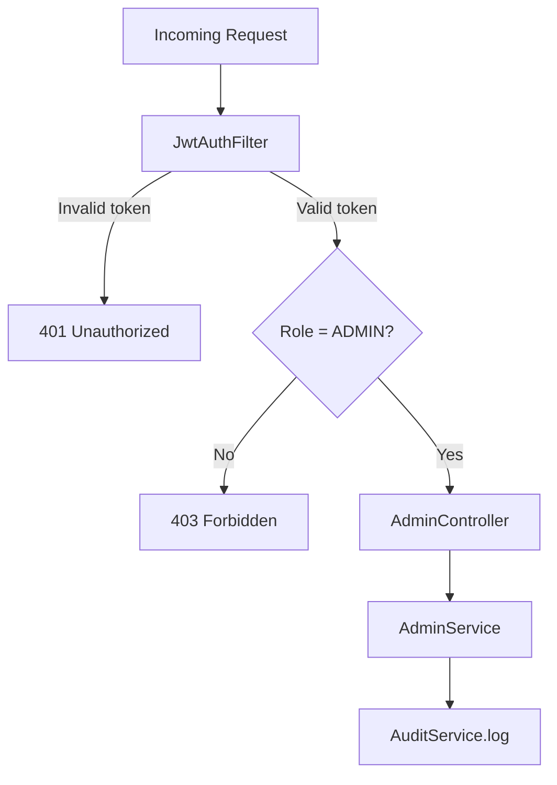
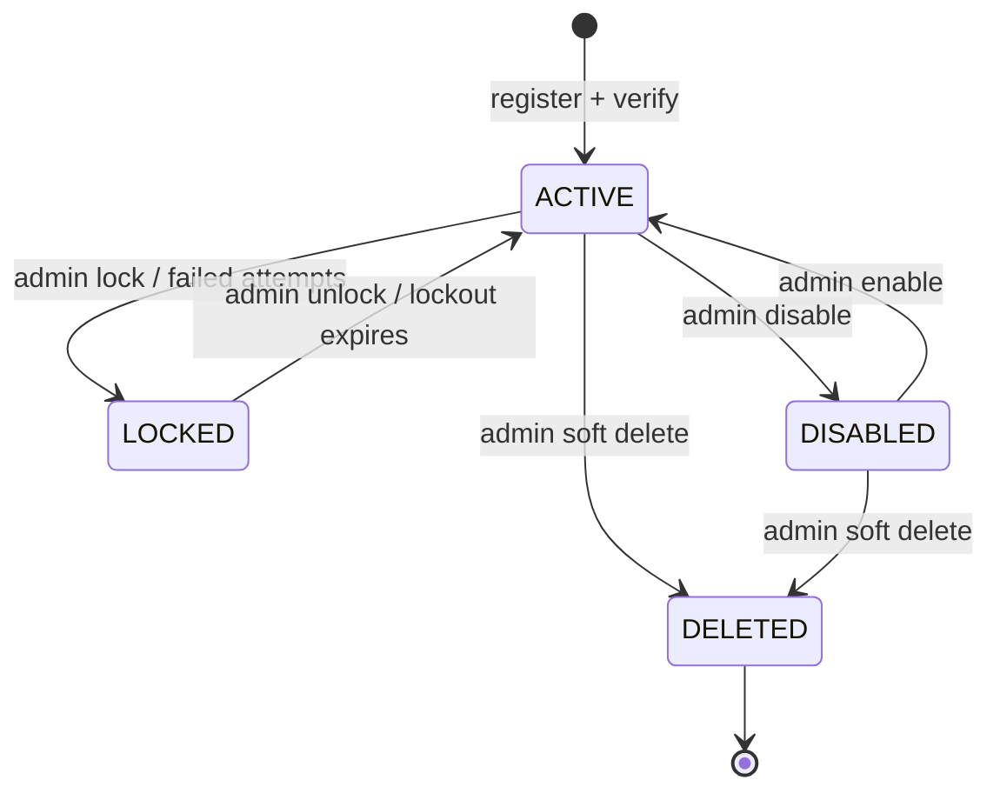

# API Design — Admin

REST endpoints for system statistics and user management. All routes require the `ADMIN` role.

**Base URL:** `/api/v1/admin`  
**Auth header:** `Authorization: Bearer <access_token>`  
**Required role:** `ADMIN`

A `USER` token on any of these endpoints returns `403 Forbidden`.

---

## System Statistics

### Get Stats

Aggregated system-wide metrics.

```
GET /api/v1/admin/stats
```

**Response `200 OK`:**

```json
{
  "status": 200,
  "message": "Admin stats fetched successfully",
  "path": "/api/v1/admin/stats",
  "data": {
    "totalUsers": 150,
    "activeUsers": 120,
    "lockedUsers": 5,
    "disabledUsers": 10,
    "deletedUsers": 15,
    "totalFiles": 3200,
    "totalStorageUsed": 5368709120,
    "totalStorageUsedFormatted": "5 GB"
  }
}
```

| Field | Type | Description |
|-------|------|-------------|
| `totalUsers` | long | All users including deleted |
| `activeUsers` | long | `status = ACTIVE`, enabled, email verified |
| `lockedUsers` | long | Currently locked accounts |
| `disabledUsers` | long | Admin-disabled accounts |
| `deletedUsers` | long | Soft-deleted accounts |
| `totalFiles` | long | Total file count across all users |
| `totalStorageUsed` | long | Sum of all file sizes in bytes |

---

## User Management

### List All Users

```
GET /api/v1/admin/users
```

**Response `200 OK`:**

```json
{
  "status": 200,
  "message": "Users fetched successfully",
  "path": "/api/v1/admin/users",
  "data": [
    {
      "id": 1,
      "firstName": "John",
      "lastName": "Doe",
      "username": "johndoe",
      "email": "john@example.com",
      "phoneNumber": "9876543210",
      "role": "USER",
      "enabled": true,
      "emailVerified": true,
      "accountNonLocked": true,
      "storageUsed": 52428800,
      "storageQuota": 1073741824,
      "createdAt": "2026-06-01T10:00:00",
      "updatedAt": "2026-06-28T14:00:00"
    }
  ]
}
```

---

### Get User by ID

```
GET /api/v1/admin/users/{id}
```

**Response `200 OK`:**

```json
{
  "status": 200,
  "message": "User fetched successfully",
  "path": "/api/v1/admin/users/1",
  "data": {
    "id": 1,
    "firstName": "John",
    "lastName": "Doe",
    "username": "johndoe",
    "email": "john@example.com",
    "phoneNumber": "9876543210",
    "role": "USER",
    "enabled": true,
    "emailVerified": true,
    "accountNonLocked": true,
    "storageUsed": 52428800,
    "storageQuota": 1073741824,
    "createdAt": "2026-06-01T10:00:00",
    "updatedAt": "2026-06-28T14:00:00"
  }
}
```

**Errors:**

| Status | Condition |
|--------|-----------|
| `404` | User not found |

---

### Update User Role

Promote or demote between `USER` and `ADMIN`.

```
PUT /api/v1/admin/users/{id}/role
```

**Request body:**

```json
{
  "role": "ADMIN"
}
```

| Field | Type | Rules |
|-------|------|-------|
| `role` | enum | Required; `USER` or `ADMIN` |

**Response `200 OK`:**

```json
{
  "status": 200,
  "message": "User role updated successfully",
  "path": "/api/v1/admin/users/1/role",
  "data": {
    "id": 1,
    "username": "johndoe",
    "email": "john@example.com",
    "role": "ADMIN",
    "enabled": true,
    "emailVerified": true,
    "accountNonLocked": true
  }
}
```

**Errors:**

| Status | Condition |
|--------|-----------|
| `400` | Invalid role value |
| `404` | User not found |
| `409` | Cannot demote the last remaining admin |

---

### Lock User

Manually lock a user account (blocks login).

```
PATCH /api/v1/admin/users/{id}/lock
```

**Response `200 OK`:**

```json
{
  "status": 200,
  "message": "User locked successfully",
  "path": "/api/v1/admin/users/1/lock",
  "data": {
    "userId": 1,
    "username": "johndoe",
    "email": "john@example.com",
    "accountNonLocked": false,
    "lockedUntil": null,
    "lockedAt": "2026-06-28T14:00:00"
  }
}
```

---

### Unlock User

Manually unlock a user account and reset failed-attempt counter.

```
POST /api/v1/admin/users/{id}/unlock
```

**Response `200 OK`:**

```json
{
  "status": 200,
  "message": "User unlocked successfully",
  "path": "/api/v1/admin/users/1/unlock",
  "data": {
    "userId": 1,
    "username": "johndoe",
    "email": "john@example.com",
    "accountNonLocked": true,
    "failedAttempts": 0,
    "unlockedAt": "2026-06-28T14:30:00"
  }
}
```

---

### Enable User

Re-activate a disabled account.

```
PATCH /api/v1/admin/users/{id}/enable
```

**Response `200 OK`:**

```json
{
  "status": 200,
  "message": "User enabled successfully",
  "path": "/api/v1/admin/users/1/enable",
  "data": {
    "id": 1,
    "username": "johndoe",
    "email": "john@example.com",
    "role": "USER",
    "enabled": true,
    "emailVerified": true,
    "accountNonLocked": true
  }
}
```

---

### Disable User

Deactivate an account without deleting it.

```
PATCH /api/v1/admin/users/{id}/disable
```

**Response `200 OK`:**

```json
{
  "status": 200,
  "message": "User disabled successfully",
  "path": "/api/v1/admin/users/1/disable",
  "data": {
    "id": 1,
    "username": "johndoe",
    "email": "john@example.com",
    "role": "USER",
    "enabled": false,
    "emailVerified": true,
    "accountNonLocked": true
  }
}
```

**Side effects:** All active tokens for the user should be invalidated.

---

### Soft Delete User

Mark a user as deleted. Data is retained for audit purposes.

```
DELETE /api/v1/admin/users/{id}
```

**Response `200 OK`:**

```json
{
  "status": 200,
  "message": "User deleted successfully",
  "path": "/api/v1/admin/users/1",
  "data": {
    "id": 1,
    "username": "johndoe",
    "email": "john@example.com",
    "role": "USER",
    "enabled": false,
    "status": "DELETED"
  }
}
```

**Errors:**

| Status | Condition |
|--------|-----------|
| `404` | User not found |
| `409` | Cannot delete the last remaining admin |

**Side effects:** User status set to `DELETED`, login blocked, tokens revoked. Files remain on disk until a separate cleanup policy runs.

---

### Update Storage Quota

Adjust a user's storage limit.

```
PATCH /api/v1/admin/users/{id}/quota
```

**Request body:**

```json
{
  "storageQuota": 2147483648
}
```

| Field | Type | Rules |
|-------|------|-------|
| `storageQuota` | long | Required; minimum bytes (e.g. 1 MB = 1048576) |

**Response `200 OK`:**

```json
{
  "status": 200,
  "message": "Storage quota updated successfully",
  "path": "/api/v1/admin/users/1/quota",
  "data": {
    "id": 1,
    "username": "johndoe",
    "storageUsed": 52428800,
    "storageQuota": 2147483648,
    "storageQuotaFormatted": "2 GB"
  }
}
```

**Errors:**

| Status | Condition |
|--------|-----------|
| `400` | New quota is less than current `storageUsed` |
| `404` | User not found |

---

## Endpoint Summary

| Method | Path | Description |
|--------|------|-------------|
| `GET` | `/api/v1/admin/stats` | System statistics |
| `GET` | `/api/v1/admin/users` | List all users |
| `GET` | `/api/v1/admin/users/{id}` | Get user by ID |
| `PUT` | `/api/v1/admin/users/{id}/role` | Update user role |
| `PATCH` | `/api/v1/admin/users/{id}/lock` | Lock user |
| `POST` | `/api/v1/admin/users/{id}/unlock` | Unlock user |
| `PATCH` | `/api/v1/admin/users/{id}/enable` | Enable user |
| `PATCH` | `/api/v1/admin/users/{id}/disable` | Disable user |
| `DELETE` | `/api/v1/admin/users/{id}` | Soft delete user |
| `PATCH` | `/api/v1/admin/users/{id}/quota` | Update storage quota |

---

## Authorization



All admin actions are recorded in the audit log with the acting admin's ID, target user ID, action type, and client IP.

---

## Admin User Lifecycle



| Transition | Endpoint | Reversible? |
|------------|----------|:-----------:|
| Lock | `PATCH .../lock` | Yes — unlock |
| Unlock | `POST .../unlock` | — |
| Disable | `PATCH .../disable` | Yes — enable |
| Enable | `PATCH .../enable` | — |
| Soft delete | `DELETE .../{id}` | No (v1) |

---

## Seeded Admin

On first startup, `AdminInitializer` creates a default admin if none exists:

| Field | Source |
|-------|--------|
| Username | `ADMIN_USERNAME` env var |
| Email | `ADMIN_EMAIL` env var |
| Password | `ADMIN_PASSWORD` env var |
| Role | `ADMIN` |

This account is required to bootstrap the system before any other admin can be promoted.
