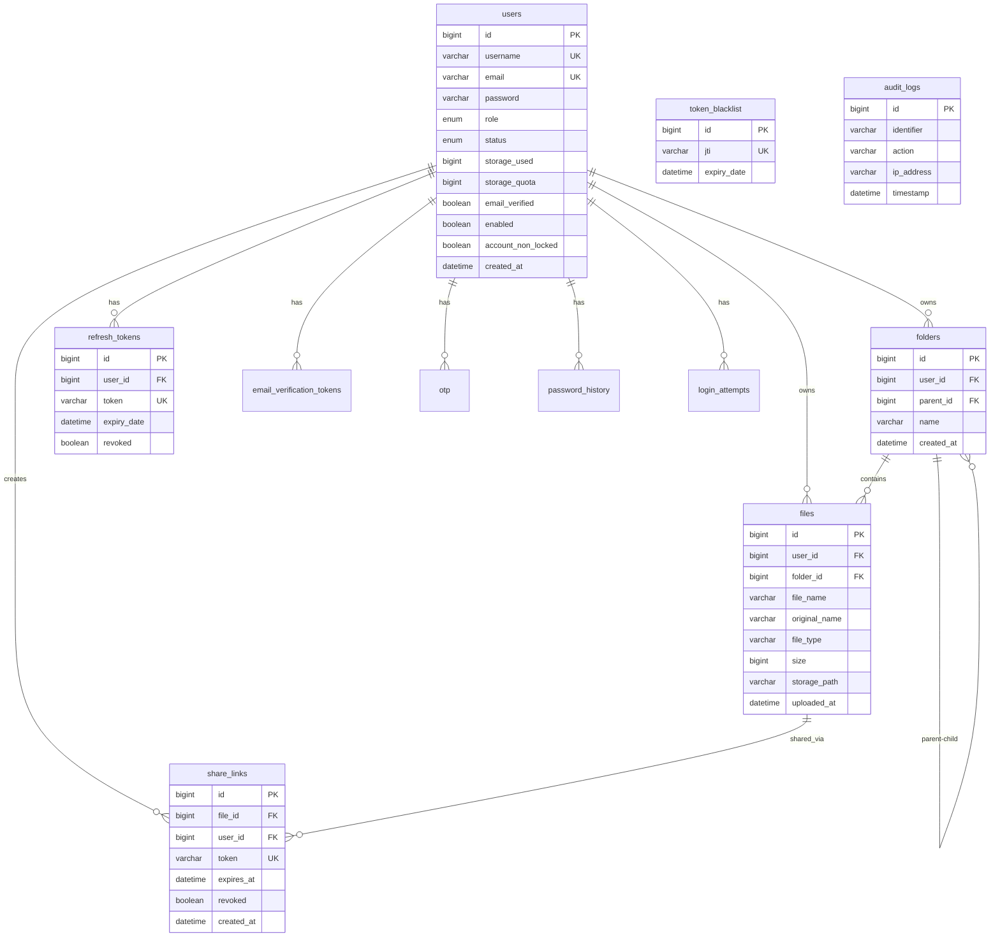
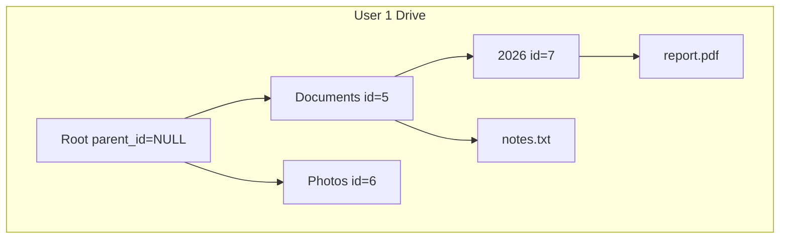

# Database Design

MySQL schema for clyDrive — entity relationships, table definitions, indexes, and folder hierarchy model.

**Database name:** `cloud_storage_system`  
**ORM:** Spring Data JPA · Hibernate `ddl-auto=update`

---

## ER Diagram



---

## Base Columns (AuditableEntity)

Most tables inherit these audit columns via `AuditableEntity`:

| Column | Type | Description |
|--------|------|-------------|
| `created_at` | `DATETIME` | Auto-set on insert |
| `updated_at` | `DATETIME` | Auto-set on update |
| `created_by` | `VARCHAR` | Username from security context |
| `updated_by` | `VARCHAR` | Username from security context |

---

## Core Tables

### `users`

Central account table.

| Column | Type | Constraints | Description |
|--------|------|-------------|-------------|
| `id` | `BIGINT` | PK, AUTO_INCREMENT | User ID |
| `first_name` | `VARCHAR(50)` | NOT NULL | First name |
| `last_name` | `VARCHAR(50)` | NOT NULL | Last name |
| `username` | `VARCHAR(50)` | NOT NULL, UNIQUE | Login username |
| `email` | `VARCHAR(100)` | NOT NULL, UNIQUE | Email address |
| `password` | `VARCHAR(255)` | NOT NULL | BCrypt hash |
| `phone_number` | `VARCHAR(15)` | UNIQUE | Mobile number |
| `role` | `ENUM` | NOT NULL | `USER`, `ADMIN` |
| `status` | `ENUM` | NOT NULL, DEFAULT `ACTIVE` | `ACTIVE`, `DISABLED`, `LOCKED`, `DELETED` |
| `storage_used` | `BIGINT` | NOT NULL, DEFAULT `0` | Bytes consumed |
| `storage_quota` | `BIGINT` | NOT NULL | Max bytes allowed |
| `email_verified` | `BOOLEAN` | NOT NULL, DEFAULT `false` | Email confirmed |
| `phone_verified` | `BOOLEAN` | NOT NULL, DEFAULT `false` | Phone confirmed |
| `enabled` | `BOOLEAN` | NOT NULL, DEFAULT `true` | Admin enable flag |
| `account_non_locked` | `BOOLEAN` | NOT NULL, DEFAULT `true` | Lockout flag |
| `failed_attempts` | `INT` | NOT NULL, DEFAULT `0` | Consecutive failed logins |
| `locked_until` | `DATETIME` | NULL | Auto-lockout expiry |
| `last_login_at` | `DATETIME` | NULL | Last successful login |

**Indexes:** `uk_user_username`, `uk_user_email`, `idx_users_status`, `idx_users_role`

---

### `files`

File metadata. Binary content stored on disk at `storage_path`.

| Column | Type | Constraints | Description |
|--------|------|-------------|-------------|
| `id` | `BIGINT` | PK, AUTO_INCREMENT | File ID |
| `user_id` | `BIGINT` | NOT NULL, FK → `users.id` | Owner |
| `folder_id` | `BIGINT` | NULL, FK → `folders.id` | Parent folder; NULL = root |
| `file_name` | `VARCHAR(255)` | NOT NULL | Stored name (UUID-based) |
| `original_name` | `VARCHAR(255)` | NOT NULL | User-facing display name |
| `file_type` | `VARCHAR(100)` | NULL | MIME type |
| `size` | `BIGINT` | NOT NULL | Size in bytes |
| `storage_path` | `VARCHAR(500)` | NOT NULL | Path on disk |
| `uploaded_at` | `DATETIME` | NOT NULL | Upload timestamp |

**Indexes:** `idx_files_user_id`, `idx_files_folder_id`, `idx_files_user_folder`

---

### `folders`

Hierarchical folder structure using self-referencing `parent_id`.

| Column | Type | Constraints | Description |
|--------|------|-------------|-------------|
| `id` | `BIGINT` | PK, AUTO_INCREMENT | Folder ID |
| `user_id` | `BIGINT` | NOT NULL, FK → `users.id` | Owner |
| `parent_id` | `BIGINT` | NULL, FK → `folders.id` | Parent folder; NULL = root |
| `name` | `VARCHAR(255)` | NOT NULL | Folder display name |

**Indexes:** `idx_folders_user_id`, `idx_folders_parent_id`, `uk_folders_user_parent_name` (unique name per parent per user)

---

### `share_links`

Time-limited public access tokens for files.

| Column | Type | Constraints | Description |
|--------|------|-------------|-------------|
| `id` | `BIGINT` | PK, AUTO_INCREMENT | Share ID |
| `file_id` | `BIGINT` | NOT NULL, FK → `files.id` | Shared file |
| `user_id` | `BIGINT` | NOT NULL, FK → `users.id` | Owner who created share |
| `token` | `VARCHAR(64)` | NOT NULL, UNIQUE | Public access token |
| `expires_at` | `DATETIME` | NOT NULL | Link expiry |
| `revoked` | `BOOLEAN` | NOT NULL, DEFAULT `false` | Manually revoked |

**Indexes:** `uk_share_token`, `idx_share_file_id`, `idx_share_expires_at`

---

## Auth & Token Tables

### `refresh_tokens`

| Column | Type | Constraints | Description |
|--------|------|-------------|-------------|
| `id` | `BIGINT` | PK | Token ID |
| `user_id` | `BIGINT` | NOT NULL, FK | Owner |
| `token` | `VARCHAR(1000)` | NOT NULL, UNIQUE | Refresh token value |
| `expiry_date` | `DATETIME` | NOT NULL | Expiration |
| `revoked` | `BOOLEAN` | NOT NULL | Revoked on logout |

### `token_blacklist`

| Column | Type | Constraints | Description |
|--------|------|-------------|-------------|
| `id` | `BIGINT` | PK | Record ID |
| `jti` | `VARCHAR(255)` | NOT NULL, UNIQUE | JWT ID from access token |
| `expiry_date` | `DATETIME` | NOT NULL | Auto-purge after this date |

### `email_verification_tokens`

| Column | Type | Constraints | Description |
|--------|------|-------------|-------------|
| `id` | `BIGINT` | PK | Token ID |
| `token` | `VARCHAR(255)` | NOT NULL, UNIQUE | Verification token |
| `user_id` | `BIGINT` | NOT NULL, FK → `users.id` | Target user |
| `expiry_date` | `DATETIME` | NOT NULL | Token expiry |
| `used` | `BOOLEAN` | NOT NULL | Already consumed |
| `resend_count` | `INT` | DEFAULT `0` | Resend attempts |

### `otp`

General-purpose OTP (password reset, etc.).

| Column | Type | Constraints | Description |
|--------|------|-------------|-------------|
| `otp_id` | `BIGINT` | PK | OTP ID |
| `otp_code` | `VARCHAR(6)` | NOT NULL | 6-digit code |
| `purpose` | `ENUM` | NOT NULL | `PASSWORD_RESET`, etc. |
| `email` | `VARCHAR(100)` | NOT NULL | Target email |
| `user_id` | `BIGINT` | NOT NULL, FK | Target user |
| `is_verified` | `BOOLEAN` | NOT NULL | OTP confirmed |
| `attempt_count` | `INT` | NOT NULL | Verification attempts |
| `expiry_time` | `DATETIME` | NOT NULL | OTP expiry |

### `password_reset_otp`

| Column | Type | Constraints | Description |
|--------|------|-------------|-------------|
| `id` | `BIGINT` | PK | Record ID |
| `email` | `VARCHAR(100)` | NOT NULL | Target email |
| `otp` | `VARCHAR(6)` | NOT NULL | OTP code |
| `phone_number` | `VARCHAR(15)` | NULL | Optional phone |
| `verified` | `BOOLEAN` | NOT NULL | OTP confirmed |
| `expiry_time` | `DATETIME` | NOT NULL | OTP expiry |

### `password_history`

| Column | Type | Constraints | Description |
|--------|------|-------------|-------------|
| `id` | `BIGINT` | PK | Record ID |
| `user_id` | `BIGINT` | NOT NULL | User reference |
| `password_hash` | `VARCHAR(255)` | NOT NULL | Previous BCrypt hash |
| `changed_at` | `DATETIME` | NULL | When password was set |

**Retention:** Keep last 5 entries per user; older rows deleted on new password set.

### `login_attempts`

| Column | Type | Constraints | Description |
|--------|------|-------------|-------------|
| `id` | `BIGINT` | PK | Attempt ID |
| `user_id` | `BIGINT` | NOT NULL | Target user |
| `email` | `VARCHAR(100)` | NULL | Email used |
| `login_identifier` | `VARCHAR(100)` | NULL | Username or email |
| `identifier_type` | `VARCHAR(20)` | NULL | `USERNAME` or `EMAIL` |
| `ip_address` | `VARCHAR(45)` | NULL | Client IP |
| `user_agent` | `VARCHAR(1000)` | NULL | Browser/client info |
| `device_info` | `VARCHAR(255)` | NULL | Parsed device string |
| `attempt_status` | `ENUM` | NULL | `SUCCESS`, `FAILED`, `LOCKED` |
| `failure_reason` | `VARCHAR(255)` | NULL | Why login failed |
| `failed_attempts` | `INT` | NULL | Count at time of attempt |
| `account_locked` | `BOOLEAN` | NULL | Was account locked |
| `lock_time` | `DATETIME` | NULL | When lock occurred |
| `attempt_time` | `DATETIME` | NOT NULL | Timestamp |

**Indexes:** `idx_login_attempts_user_id`, `idx_login_attempts_attempt_time`

---

## Audit Table

### `audit_logs`

| Column | Type | Constraints | Description |
|--------|------|-------------|-------------|
| `id` | `BIGINT` | PK | Log ID |
| `identifier` | `VARCHAR(100)` | NULL | Username or email |
| `action` | `VARCHAR(100)` | NOT NULL | `LOGIN`, `UPLOAD`, `DELETE`, `SHARE`, etc. |
| `ip_address` | `VARCHAR(100)` | NULL | Client IP |
| `device_info` | `VARCHAR(1000)` | NULL | User agent |
| `timestamp` | `DATETIME` | NOT NULL | When action occurred |
| `details` | `VARCHAR(2000)` | NULL | Extra context (JSON or text) |

**Indexes:** `idx_audit_action`, `idx_audit_timestamp`, `idx_audit_identifier`

---

## Folder Hierarchy Model

Folders use a **self-referencing adjacency list** — each row points to its parent via `parent_id`.



### Rules

| Rule | Enforcement |
|------|-------------|
| Root folders | `parent_id IS NULL` |
| Nesting | `parent_id` references another folder owned by the same `user_id` |
| No circular refs | Service validates parent chain before move/create |
| Unique names | Same name allowed in different parents; unique within same parent per user |
| Delete | Folder must be empty (no files, no subfolders) before deletion |
| Files at root | `files.folder_id IS NULL` |

### Breadcrumb query (conceptual)

```sql
-- Recursive CTE to resolve path from root to folder id=7
WITH RECURSIVE breadcrumb AS (
    SELECT id, name, parent_id, 0 AS depth
    FROM folders WHERE id = 7
    UNION ALL
    SELECT f.id, f.name, f.parent_id, b.depth + 1
    FROM folders f
    JOIN breadcrumb b ON f.id = b.parent_id
)
SELECT id, name FROM breadcrumb ORDER BY depth DESC;
```

---

## Relationships Summary

| From | To | Cardinality | FK Column |
|------|----|-------------|-----------|
| `users` | `files` | 1 : N | `files.user_id` |
| `users` | `folders` | 1 : N | `folders.user_id` |
| `folders` | `folders` | 1 : N | `folders.parent_id` |
| `folders` | `files` | 1 : N | `files.folder_id` |
| `files` | `share_links` | 1 : N | `share_links.file_id` |
| `users` | `refresh_tokens` | 1 : N | `refresh_tokens.user_id` |
| `users` | `email_verification_tokens` | 1 : N | `email_verification_tokens.user_id` |
| `users` | `otp` | 1 : N | `otp.user_id` |
| `users` | `password_history` | 1 : N | `password_history.user_id` |
| `users` | `login_attempts` | 1 : N | `login_attempts.user_id` |

---

## Table Count

| Group | Tables |
|-------|--------|
| Core | `users`, `files`, `folders`, `share_links` |
| Auth & tokens | `refresh_tokens`, `token_blacklist`, `email_verification_tokens`, `otp`, `password_reset_otp`, `password_history` |
| Security & audit | `login_attempts`, `audit_logs` |
| **Total** | **12 tables** |

---

## Default Values

| Setting | Value |
|---------|-------|
| Default `storage_quota` on registration | 1 GB (`1073741824` bytes) |
| Default `role` on registration | `USER` |
| Default `status` on registration | `ACTIVE` (login blocked until `email_verified`) |
| Seeded admin | Created by `AdminInitializer` on first startup |
