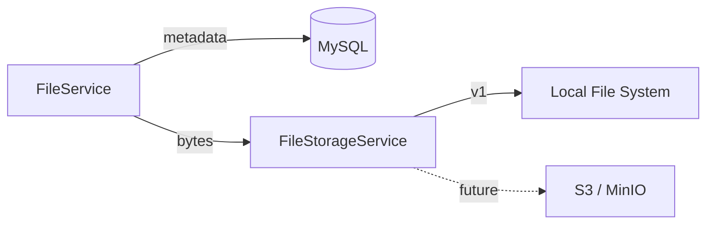
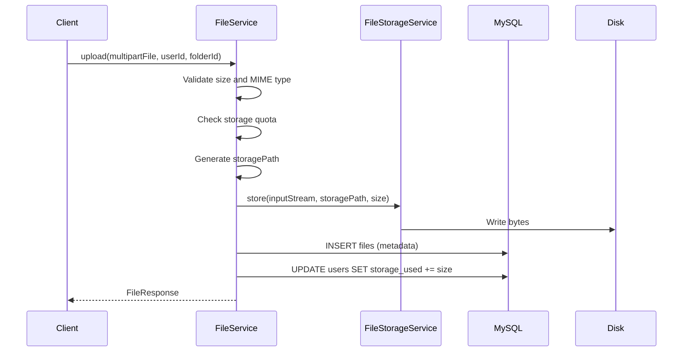
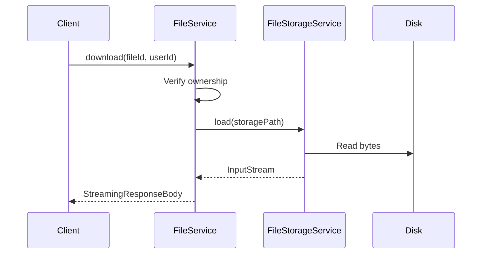
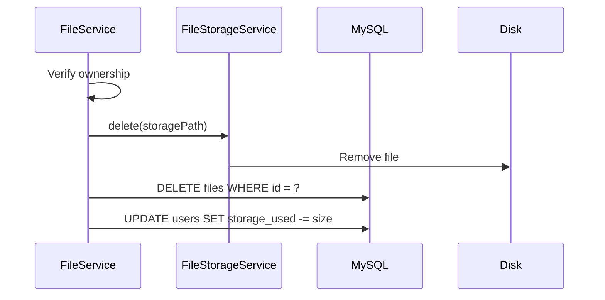

# File Storage Strategy

How clyDrive stores file bytes — local disk in v1, with an abstraction layer designed for future S3-compatible backends.

---

## Core Principle

**Metadata in MySQL, bytes on storage.**

| Concern | Stored in | Examples |
|---------|-----------|----------|
| Metadata | MySQL (`files` table) | `original_name`, `file_type`, `size`, `user_id`, `folder_id` |
| Content | File storage backend | Raw file bytes |

The `FileService` orchestrates both: it writes metadata and delegates byte I/O to `FileStorageService`.



---

## Storage Interface

All byte-level operations go through a single interface. Services never touch the file system directly.

```java
public interface FileStorageService {

    /** Write bytes and return the storage path */
    String store(InputStream inputStream, String storagePath, long size);

    /** Read bytes as a stream */
    InputStream load(String storagePath);

    /** Delete bytes at path; no-op if missing */
    void delete(String storagePath);

    /** Check if path exists on storage */
    boolean exists(String storagePath);
}
```

| Method | Used by | Description |
|--------|---------|-------------|
| `store` | Upload | Write file to storage |
| `load` | Download, share | Stream file to client |
| `delete` | Delete file | Remove bytes from storage |
| `exists` | Integrity check | Verify file is on disk |

---

## v1 — Local Disk Implementation

`LocalFileStorageService` implements the interface using the local file system.

### Directory layout

```
{storage.root}/
└── users/
    └── {userId}/
        └── {year}/
            └── {month}/
                └── {uuid}_{sanitizedName}
```

**Example:**

```
./uploads/users/42/2026/06/a1b2c3d4-report.pdf
```

| Segment | Purpose |
|---------|---------|
| `users/{userId}` | Isolate files per user |
| `{year}/{month}` | Partition for easier backup and cleanup |
| `{uuid}_{name}` | Unique path; avoids name collisions |

### Path generation

```java
String uuid = UUID.randomUUID().toString().substring(0, 8);
String sanitized = sanitizeFilename(originalName);  // strip ../, special chars
String storagePath = String.format(
    "users/%d/%d/%02d/%s-%s",
    userId, year, month, uuid, sanitized
);
```

The generated path is saved in `files.storage_path`. The original display name stays in `files.original_name`.

### Configuration

```properties
# application.properties
storage.root=./uploads
storage.max-file-size=52428800        # 50 MB per file
spring.servlet.multipart.max-file-size=50MB
spring.servlet.multipart.max-request-size=55MB
```

| Property | Default | Description |
|----------|---------|-------------|
| `storage.root` | `./uploads` | Base directory on disk |
| `storage.max-file-size` | `52428800` (50 MB) | Max upload size in bytes |

### Bean wiring

```java
@Configuration
public class StorageConfig {

    @Bean
    @ConditionalOnProperty(name = "storage.type", havingValue = "local", matchIfMissing = true)
    public FileStorageService localFileStorageService(
            @Value("${storage.root}") String root) {
        return new LocalFileStorageService(root);
    }
}
```

`storage.type=local` is the default. Future: `storage.type=s3` swaps the implementation.

---

## Upload Flow



### Transaction boundary

Metadata insert and quota update run in a single `@Transactional` block. If the DB write fails after disk write, the service deletes the orphaned file on disk (compensating action).

---

## Download Flow



Downloads use **streaming** — bytes flow from disk to HTTP response without loading the entire file into memory.

```java
return ResponseEntity.ok()
    .contentType(MediaType.parseMediaType(file.getFileType()))
    .header(HttpHeaders.CONTENT_DISPOSITION,
            "attachment; filename=\"" + file.getOriginalName() + "\"")
    .body(new InputStreamResource(fileStorageService.load(file.getStoragePath())));
```

---

## Delete Flow



Order: delete from disk first, then remove metadata. If disk delete fails, the transaction rolls back and metadata is preserved.

---

## Future — S3-Compatible Backend

When scaling beyond a single server, swap to object storage (AWS S3, MinIO, DigitalOcean Spaces).

### Planned implementation

```java
@Service
@ConditionalOnProperty(name = "storage.type", havingValue = "s3")
public class S3FileStorageService implements FileStorageService {

    private final S3Client s3Client;
    private final String bucket;

    @Override
    public String store(InputStream inputStream, String storagePath, long size) {
        s3Client.putObject(PutObjectRequest.builder()
            .bucket(bucket)
            .key(storagePath)
            .build(),
            RequestBody.fromInputStream(inputStream, size));
        return storagePath;
    }

    // load, delete, exists — same interface, S3 SDK underneath
}
```

### Configuration (future)

```properties
storage.type=s3
storage.s3.bucket=clydrive-files
storage.s3.region=ap-southeast-1
storage.s3.endpoint=              # optional, for MinIO
```

### What stays the same

| Layer | Changes? |
|-------|----------|
| `FileController` | No |
| `FileService` | No |
| `files` table / `storage_path` column | No — path becomes the S3 object key |
| `FileStorageService` interface | No |

Only the implementation class and config properties change.

---

## Local vs S3 Comparison

| Aspect | Local disk (v1) | S3 (future) |
|--------|-----------------|-------------|
| Setup | Create `./uploads` folder | Create bucket + IAM credentials |
| Scaling | Single server only | Multi-server, CDN-ready |
| Backup | Filesystem backup | S3 versioning / replication |
| Cost | Disk space on VM | Pay per GB stored + requests |
| Path format | `users/42/2026/06/uuid-file.pdf` | Same key structure |
| Streaming | `FileInputStream` | `S3Client.getObject` stream |

---

## Security Considerations

| Risk | Mitigation |
|------|------------|
| Path traversal (`../../etc/passwd`) | Sanitize filenames; never use user-supplied paths directly |
| Unauthorized access | `FileService` checks `user_id` before any storage call |
| Disk full | Monitor volume; reject uploads when quota exceeded |
| Orphaned files | Compensating delete on failed DB write; scheduled orphan scan (future) |
| Share download | `ShareService` validates token, then calls `FileStorageService.load` — no user auth needed |

---

## File Type Validation (v1)

| Check | Rule |
|-------|------|
| Max size | Configurable via `storage.max-file-size` |
| Empty file | Rejected with `400` |
| Blocked extensions | Optional deny-list: `.exe`, `.bat`, `.sh` (configurable) |
| MIME type | Read from `multipartFile.getContentType()`; stored in `files.file_type` |

---

## Summary

```
v1:  Client → FileService → LocalFileStorageService → ./uploads/
future: Client → FileService → S3FileStorageService → S3 bucket
```

The `FileStorageService` interface is the only seam between business logic and physical storage. Everything above it stays unchanged when migrating to cloud object storage.
