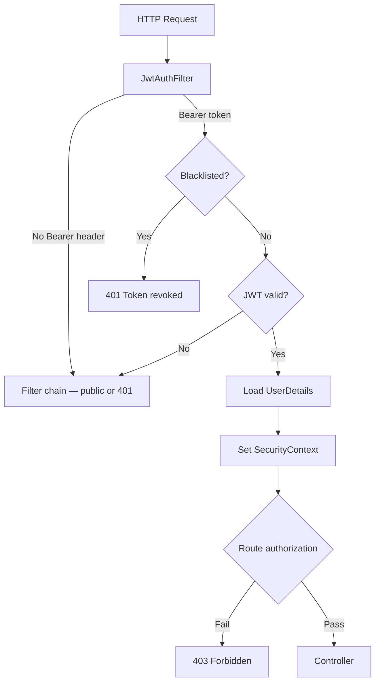
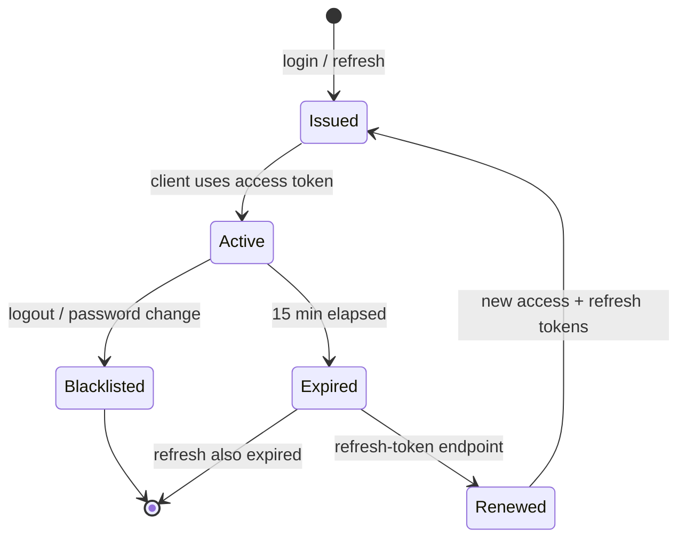
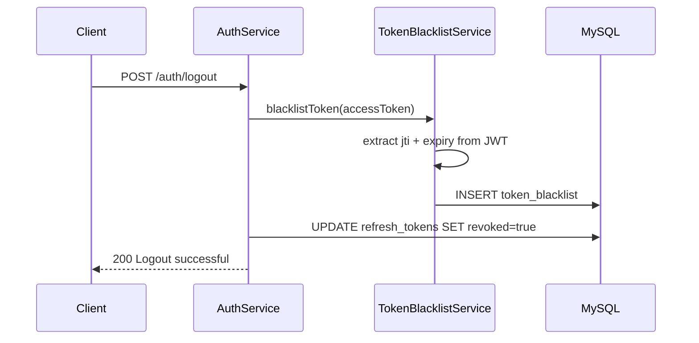
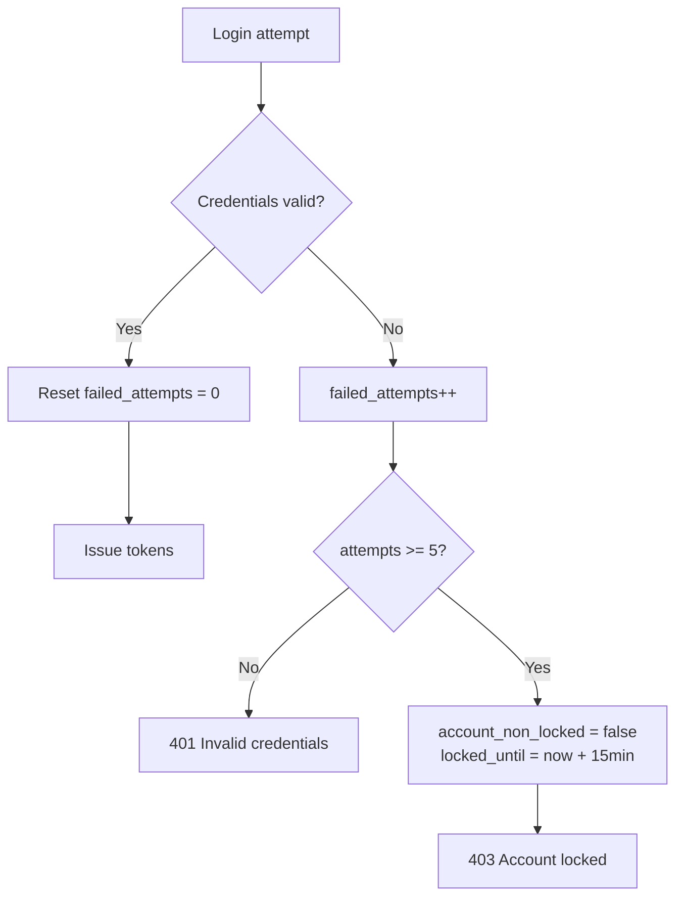

# Security Design

Authentication, authorization, token lifecycle, and account protection for clyDrive.

---

## Overview

clyDrive uses **stateless JWT authentication** with Spring Security. No server-side HTTP sessions. Every protected request carries a Bearer token that is validated on each call.



---

## JWT Token Model

Two token types are issued on login:

| Token | Lifetime | Storage (client) | Purpose |
|-------|----------|------------------|---------|
| **Access token** | 15 minutes | Memory / header | Authenticate API requests |
| **Refresh token** | 7 days | Secure storage / DB | Obtain new access token |

### Access token claims

```json
{
  "sub": "42",
  "role": "USER",
  "jti": "a1b2c3d4-e5f6-7890-abcd-ef1234567890",
  "iat": 1719561600,
  "exp": 1719562500
}
```

| Claim | Description |
|-------|-------------|
| `sub` | User ID |
| `role` | `USER` or `ADMIN` |
| `jti` | Unique token ID — used for blacklisting |
| `iat` | Issued at (Unix timestamp) |
| `exp` | Expiry (Unix timestamp) |

### Configuration

```properties
jwt.secret=${JWT_SECRET}
jwt.access-token-validity=900000       # 15 min (ms)
jwt.refresh-token-validity=604800000   # 7 days (ms)
```

| Property | Value | Notes |
|----------|-------|-------|
| `jwt.secret` | Env var | Min 256-bit key for HS256; never commit to source |
| Algorithm | `HS256` | HMAC-SHA256 via `jjwt` library |

### Token generation (`JwtUtil`)

```java
Jwts.builder()
    .setSubject(String.valueOf(user.getId()))
    .claim("role", user.getRole().name())
    .setId(UUID.randomUUID().toString())   // jti
    .setIssuedAt(new Date())
    .setExpiration(new Date(now + validity))
    .signWith(key, SignatureAlgorithm.HS256)
    .compact();
```

---

## Token Lifecycle



### Login

1. Client sends credentials to `POST /api/v1/auth/login`
2. `AuthService` validates password via `AuthenticationManager`
3. Checks: email verified, account enabled, not locked
4. Generates access + refresh tokens
5. Persists refresh token in `refresh_tokens` table
6. Records login attempt in `login_attempts`

### Refresh

1. Client sends refresh token to `POST /api/v1/auth/refresh-token`
2. Service validates: token exists, not revoked, not expired
3. Issues **new** access token and **new** refresh token (rotation)
4. Old refresh token marked `revoked = true`

### Logout

1. Client sends access token (header) + refresh token (body)
2. Access token `jti` added to `token_blacklist`
3. Refresh token marked `revoked = true`

### Password change / reset

All refresh tokens for the user are revoked. Active access tokens remain valid until expiry (max 15 min) unless individually blacklisted.

---

## Token Blacklist

When a user logs out, the access token's `jti` is stored in `token_blacklist` so it cannot be reused before natural expiry.



### Blacklist check (every request)

`JwtAuthFilter` runs before every request:

```java
if (tokenBlacklistService.isBlacklisted(token)) {
    response.sendError(401, "Token revoked");
    return;
}
```

### Cleanup

`CleanupScheduler` deletes blacklist entries where `expiry_date < now()` — no need to keep expired JTIs.

---

## Refresh Token Storage

Refresh tokens are stored in the `refresh_tokens` table (not just client-side).

| Column | Purpose |
|--------|---------|
| `token` | The refresh token value |
| `user_id` | Owner |
| `expiry_date` | 7-day expiry |
| `revoked` | Set `true` on logout, refresh, or password change |

This allows server-side revocation — a stolen refresh token can be invalidated.

---

## Role-Based Access Control (RBAC)

### Roles

| Role | Spring authority | Access |
|------|------------------|--------|
| `USER` | `ROLE_USER` | Own files, folders, shares |
| `ADMIN` | `ROLE_ADMIN` | All `USER` access + `/api/v1/admin/**` |

### Enforcement layers

**1. URL-level** (`SecurityConfig`):

```java
.authorizeHttpRequests(auth -> auth
    .requestMatchers("/api/v1/auth/**", "/api/v1/users/register").permitAll()
    .requestMatchers("/api/v1/share/**").permitAll()
    .requestMatchers("/api/v1/admin/**").hasRole("ADMIN")
    .anyRequest().authenticated())
```

**2. Method-level** (`@PreAuthorize`):

```java
@PreAuthorize("hasAnyRole('USER','ADMIN')")
@PostMapping("/logout")
public ResponseEntity<...> logout(...) { }

@PreAuthorize("hasRole('ADMIN')")
@RestController
@RequestMapping("/api/v1/admin")
public class AdminController { }
```

**3. Service-level** (resource ownership):

```java
// FileService — always verify userId matches file owner
if (!file.getUserId().equals(currentUserId)) {
    throw new AccessDeniedException("Not your file");
}
```

Admins manage **users** — they do not bypass file ownership checks.

---

## Request Filter Chain

```
HTTP Request
  → JwtAuthFilter          (validate Bearer token, set SecurityContext)
  → UsernamePasswordAuthenticationFilter  (skipped — no form login)
  → AuthorizationFilter    (check roles per URL/method)
  → Controller
```

### `CustomUserDetailsService`

Loads user from DB by ID (from JWT `sub` claim) and builds Spring `UserDetails`:

```java
User.builder()
    .username(user.getId().toString())
    .password(user.getPassword())
    .authorities(new SimpleGrantedAuthority("ROLE_" + user.getRole().name()))
    .build();
```

---

## Account Protection

### Failed login lockout

| Setting | Value |
|---------|-------|
| `security.max-failed-attempts` | `5` |
| `security.lock-time-minutes` | `15` |



### Password policy

| Rule | Enforcement |
|------|-------------|
| Min 8 chars, max 20 | `@Size` on registration request |
| Upper + lower + digit + special | `@Pattern` on registration request |
| BCrypt hashing | `PasswordEncoder` on save |
| History limit (last 5) | `password_history` table checked on reset/change |

### Email verification gate

Login is rejected if `email_verified = false`, even with correct password.

### Admin actions

| Action | Effect on login |
|--------|-----------------|
| `disable` | `enabled = false` → login blocked |
| `lock` | `account_non_locked = false` → login blocked |
| `soft delete` | `status = DELETED` → login blocked |

---

## HTTP Security Headers

Configured in `SecurityConfig`:

| Header | Value | Purpose |
|--------|-------|---------|
| `Strict-Transport-Security` | `max-age=31536000; includeSubDomains` | Force HTTPS |
| `Content-Security-Policy` | `default-src 'self'; frame-ancestors 'none'` | XSS / clickjacking |
| `X-Frame-Options` | `DENY` | Clickjacking protection |
| `X-Content-Type-Options` | `nosniff` | MIME sniffing protection |
| `Referrer-Policy` | `no-referrer` | Leak prevention |

---

## Public vs Protected Routes

| Route pattern | Auth required |
|---------------|:-------------:|
| `/api/v1/users/register` | No |
| `/api/v1/auth/login` | No |
| `/api/v1/auth/refresh-token` | No |
| `/api/v1/auth/verify-email` | No |
| `/api/v1/auth/forgot-password/**` | No |
| `/api/v1/auth/reset-password` | No |
| `/api/v1/share/{token}` | No |
| `/api/v1/admin/**` | Yes — `ADMIN` |
| All other `/api/v1/**` | Yes — `USER` or `ADMIN` |

---

## Security Components

| Class | Package | Role |
|-------|---------|------|
| `SecurityConfig` | `config` | Filter chain, URL rules, headers |
| `JwtUtil` | `util` | Generate, parse, validate JWTs |
| `JwtAuthFilter` | `security` | Per-request token validation |
| `JwtAuthenticationEntryPoint` | `security` | 401 response for unauthenticated |
| `CustomUserDetailsService` | `security` | Load user + authorities from DB |
| `TokenBlacklistService` | `service` | Blacklist/revoke access tokens |
| `AuthService` | `service` | Login, logout, refresh, password flows |
| `SecurityProperties` | `config` | Externalized lockout/history limits |
| `PasswordConfig` | `config` | `BCryptPasswordEncoder` bean |
| `CleanupScheduler` | `scheduler` | Purge expired blacklist entries and tokens |

---

## Threat Mitigations

| Threat | Mitigation |
|--------|------------|
| Stolen access token | Short 15-min lifetime + blacklist on logout |
| Stolen refresh token | Server-side storage with revocation |
| Brute-force login | Account lockout after 5 failures |
| Password reuse | History check (last 5) |
| CSRF | Stateless API — CSRF disabled (no cookies) |
| Credential in source | `JWT_SECRET`, mail creds via env vars |
| Privilege escalation | `@PreAuthorize` + service-level ownership checks |
| Expired share links | `expires_at` checked on every public download |

---

## Seeded Admin Security

`AdminInitializer` creates the first admin from environment variables on startup:

```properties
ADMIN_USERNAME=admin
ADMIN_EMAIL=admin@clydrive.local
ADMIN_PASSWORD=${ADMIN_PASSWORD}
```

Only runs if no user with `role = ADMIN` exists. Password must be changed after first login in production.
