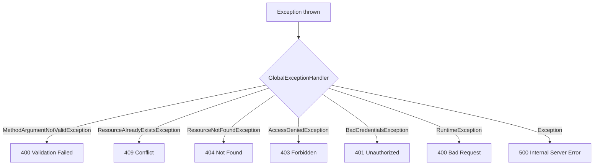
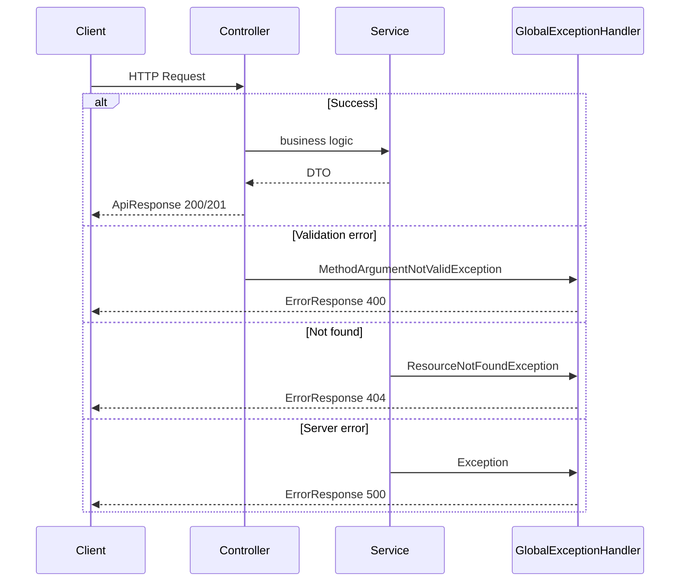

# API Response & Error Handling

Standard response format and centralized error handling for all clyDrive endpoints.

---

## Design Goal

Every API response follows a **consistent JSON shape** so clients can parse success and failure uniformly — regardless of which module (auth, files, admin) produced the response.

```
Success → ApiResponse<T>   (status, message, path, data, timestamp)
Error   → ErrorResponse    (status, message, path, errors?, timestamp)
```

---

## Success Response — `ApiResponse<T>`

Generic wrapper used by all controllers on successful requests.

### Structure

```json
{
  "status": 200,
  "message": "Login successful",
  "path": "/api/v1/auth/login",
  "data": { },
  "timestamp": "2026-06-28T14:30:00"
}
```

| Field | Type | Description |
|-------|------|-------------|
| `status` | `int` | HTTP status code |
| `message` | `string` | Human-readable summary |
| `path` | `string` | Request URI |
| `data` | `T` | Payload — type varies per endpoint |
| `timestamp` | `datetime` | Server time when response was built |

### Java class

```java
@Data
@Builder
@JsonInclude(JsonInclude.Include.NON_NULL)
@JsonPropertyOrder({ "status", "message", "path", "data", "timestamp" })
public class ApiResponse<T> {

    private int status;
    private String message;
    private String path;

    @JsonInclude(JsonInclude.Include.ALWAYS)
    private T data;

    private LocalDateTime timestamp;

    public static <T> ApiResponse<T> success(int status, String message, String path, T data) {
        return ApiResponse.<T>builder()
                .status(status)
                .message(message)
                .path(path)
                .data(data)
                .timestamp(LocalDateTime.now())
                .build();
    }
}
```

### Controller usage

```java
return ResponseEntity.ok(
    ApiResponse.success(
        HttpStatus.OK.value(),
        "File uploaded successfully",
        request.getRequestURI(),
        fileResponse
    )
);

return ResponseEntity.status(HttpStatus.CREATED).body(
    ApiResponse.success(
        HttpStatus.CREATED.value(),
        "User registered successfully",
        request.getRequestURI(),
        userResponse
    )
);
```

### Success examples

**Single object:**

```json
{
  "status": 200,
  "message": "File fetched successfully",
  "path": "/api/v1/files/42",
  "data": {
    "id": 42,
    "originalName": "report.pdf",
    "size": 1048576
  },
  "timestamp": "2026-06-28T14:30:00"
}
```

**List:**

```json
{
  "status": 200,
  "message": "Users fetched successfully",
  "path": "/api/v1/admin/users",
  "data": [ { "id": 1, "username": "johndoe" } ],
  "timestamp": "2026-06-28T14:30:00"
}
```

**Paginated:**

```json
{
  "status": 200,
  "message": "Files fetched successfully",
  "path": "/api/v1/files",
  "data": {
    "content": [ ],
    "page": 0,
    "size": 20,
    "totalElements": 45,
    "totalPages": 3
  },
  "timestamp": "2026-06-28T14:30:00"
}
```

---

## Error Response — `ErrorResponse`

Used by `GlobalExceptionHandler` for all failures. Does **not** wrap in `ApiResponse`.

### Structure

```json
{
  "status": 400,
  "message": "Validation Failed",
  "path": "/api/v1/users/register",
  "errors": {
    "email": "Invalid email format",
    "password": "Password must contain uppercase, lowercase, number and special character"
  },
  "timestamp": "2026-06-28T14:30:00"
}
```

| Field | Type | Description |
|-------|------|-------------|
| `status` | `int` | HTTP status code |
| `message` | `string` | Error summary |
| `path` | `string` | Request URI |
| `errors` | `object` | Optional — field-level validation errors |
| `timestamp` | `datetime` | Server time |

### Java class

```java
@Data
@Builder
@JsonInclude(JsonInclude.Include.NON_NULL)
@JsonPropertyOrder({ "status", "message", "path", "errors", "timestamp" })
public class ErrorResponse {

    private int status;
    private String message;
    private String path;
    private Object errors;
    private LocalDateTime timestamp;
}
```

---

## Global Exception Handler

`@RestControllerAdvice` class that catches exceptions and maps them to `ErrorResponse` with the correct HTTP status.



### Handler mappings

| Exception | HTTP Status | Message |
|-----------|:-----------:|---------|
| `MethodArgumentNotValidException` | `400` | `Validation Failed` + field errors |
| `ResourceAlreadyExistsException` | `409` | Exception message (e.g. "Email already exists") |
| `ResourceNotFoundException` | `404` | Exception message (e.g. "File not found") |
| `AccessDeniedException` | `403` | `Access denied` |
| `BadCredentialsException` | `401` | `Invalid credentials` |
| `AccountLockedException` | `403` | `Account is locked` |
| `StorageQuotaExceededException` | `403` | `Storage quota exceeded` |
| `ShareLinkExpiredException` | `410` | `Share link expired or revoked` |
| `RuntimeException` | `400` | Exception message |
| `Exception` (catch-all) | `500` | `Something went wrong` |

### Validation error handler

Triggered by `@Valid` on request bodies:

```java
@ExceptionHandler(MethodArgumentNotValidException.class)
public ResponseEntity<ErrorResponse> handleValidationException(
        MethodArgumentNotValidException ex,
        HttpServletRequest request) {

    Map<String, String> errors = new HashMap<>();
    ex.getBindingResult().getFieldErrors()
            .forEach(error -> errors.put(error.getField(), error.getDefaultMessage()));

    ErrorResponse response = ErrorResponse.builder()
            .status(HttpStatus.BAD_REQUEST.value())
            .message("Validation Failed")
            .path(request.getRequestURI())
            .errors(errors)
            .timestamp(LocalDateTime.now())
            .build();

    return ResponseEntity.badRequest().body(response);
}
```

**Example response:**

```json
{
  "status": 400,
  "message": "Validation Failed",
  "path": "/api/v1/users/register",
  "errors": {
    "username": "Username must be between 4 and 20 characters",
    "email": "Invalid email format"
  },
  "timestamp": "2026-06-28T14:30:00"
}
```

### Conflict handler

```json
{
  "status": 409,
  "message": "Email already registered",
  "path": "/api/v1/users/register",
  "timestamp": "2026-06-28T14:30:00"
}
```

### Catch-all handler

Logs the full stack trace server-side but returns a generic message to the client:

```json
{
  "status": 500,
  "message": "Something went wrong",
  "path": "/api/v1/files/upload",
  "timestamp": "2026-06-28T14:30:00"
}
```

Never expose stack traces or internal details in the response body.

---

## HTTP Status Code Reference

| Code | When | Example |
|:----:|------|---------|
| `200` | Success (read, update, delete) | Get file metadata |
| `201` | Resource created | Register, upload, create folder |
| `400` | Bad input or business rule violation | Validation failure, folder not empty |
| `401` | Not authenticated | Missing/invalid/expired/revoked token |
| `403` | Authenticated but not allowed | Wrong user, quota exceeded, non-admin on admin route |
| `404` | Resource not found | File, folder, or user ID does not exist |
| `409` | Conflict | Duplicate username/email, delete last admin |
| `410` | Gone | Expired or revoked share link |
| `500` | Unexpected server error | Unhandled exception |

---

## Custom Exceptions

| Exception | Package | Thrown when |
|-----------|---------|-------------|
| `ResourceAlreadyExistsException` | `exception` | Duplicate username, email, or folder name |
| `ResourceNotFoundException` | `exception` | Entity ID not found |
| `AccountLockedException` | `exception` | Login on locked account |
| `StorageQuotaExceededException` | `exception` | Upload exceeds quota |
| `ShareLinkExpiredException` | `exception` | Share token expired or revoked |
| `EmailNotVerifiedException` | `exception` | Login before email verification |

All extend `RuntimeException` with a descriptive message passed to the handler.

---

## Security Error Responses

Handled outside `GlobalExceptionHandler` in some cases:

| Scenario | Source | Response |
|----------|--------|----------|
| No Bearer token on protected route | `JwtAuthenticationEntryPoint` | `401` — `Unauthorized` |
| Blacklisted token | `JwtAuthFilter` | `401` — `Token revoked` |
| Wrong role (USER on admin route) | Spring Security | `403` — `Forbidden` |

---

## Jackson Serialization Rules

Applied globally via `application.properties`:

```properties
spring.jackson.serialization.fail-on-empty-beans=false
spring.jackson.default-property-inclusion=non_null
```

| Rule | Effect |
|------|--------|
| `non_null` | Null fields omitted from JSON |
| `fail-on-empty-beans=false` | Empty objects serialize without error |
| `@JsonPropertyOrder` | Consistent field ordering in responses |
| `data` always included | `@JsonInclude(ALWAYS)` on `ApiResponse.data` — returns `{}` or `null` explicitly |

---

## Request → Response Flow



---

## Design Documentation Index

| # | Document | Topic |
|---|----------|-------|
| 06 | [System Architecture](06-architecture.md) | Layers, components, request flow |
| 07 | [API — Auth & Users](07-api-auth-and-users.md) | Registration, login, password |
| 08 | [API — Files, Folders & Sharing](08-api-files-folders-sharing.md) | Storage, folders, share links |
| 09 | [API — Admin](09-api-admin.md) | User management, stats |
| 10 | [Database Design](10-database-design.md) | ER diagram, tables, folder model |
| 11 | [File Storage Strategy](11-file-storage-strategy.md) | Local disk, S3 abstraction |
| 12 | [Security Design](12-security-design.md) | JWT, RBAC, token blacklist |
| 13 | API Response & Error Handling | This document |
